# Boston Mutual Aid Site

## Team Mejia Development Team

* Aira Cosino
* Jared Min
* Jeffrey Jin
* Johanne Antoine
* Suhail Singh
* Zeyu Gu
* Zhengqi Dong
* Julian Maldonado

## Index
- [Technologies Used](#tech-stack)
- [Requirements](#requirements)
- [Quick Start](#quick-start)
- [Adding More Languages to the Website](#adding-more-languages-to-the-website)
- [How To Deploy](#how-to-deploy)
- [Debug/Troubleshooting](#debugtroubleshooting)
- [Reference](#reference)


## Tech Stack  
For the backend, we used Prisma as database client, Express as our backend framework.  
For the frontend, we used React as our frontend framework and Gatsby static site generator to build/generate our website.  
Here is an overview of our technical architecture:  
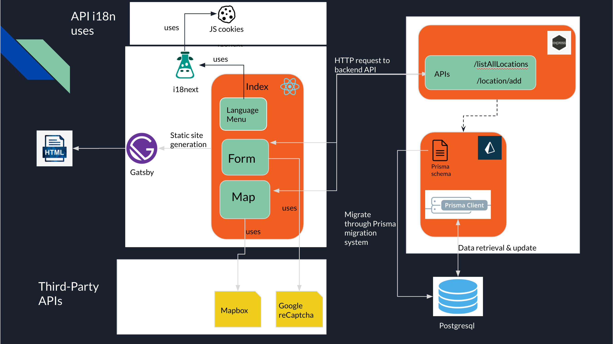

## Requirements
Before you run the frontend and backend of the website, you have to register a Mapbox account. You also need to register
for Google reCaptcha v2.  
You can create a Mapbox account [here](https://account.mapbox.com)  
You can register for Google reCaptcha [here](https://developers.google.com/recaptcha/intro?hl=en)
### Frontend
For dev on the frontend you'll need to install:
- React (instructions to install can be found [here](https://reactjs.org/docs/create-a-new-react-app.html))

### Backend
For dev on the backend you'll need to install: 
- Express (instructions to install can be found [here](https://expressjs.com/en/starter/installing.html))
- Prisma (instructions to install can be found [here](https://www.prisma.io/docs/getting-started/quickstart-typescript))

## Quick Start

### Frontend
#### In Development mode
1. Set up Gatsby (refer to this [Readme](./frontend/README.md))
2. Go into frontend folder
```bash
$ cd frontend
```
3. Install the node packages
```bash
$ npm install
```
4. Create a file called .env.development inside the frontend folder. Add your MapBox Access Token as a variable named `GATSBY_MAPBOX_ACCESS_TOKEN` to .env.development. Add your reCaptcha secret key as a variable named `SECRET_KEY`. 
   Add the backend url as a variable named `BACKEND_URL`. Then run: 
```bash
$ npm run develop
```
The site should be running on [http://0.0.0.0:8000](http://0.0.0.0:8000)\
Make sure to have backend running before running the frontend.

#### In Production mode  
To build the frontend application in production mode, follow the first 3 setup steps in development mode.  
For step 4, you will need to create a file called .env.production inside the frontend folder, which will contain the environment variables you need to access while building the application.  
Next, you will need to uncomment some code in `gatsby-node.js` and `gatsby-ssr.js`. Namely, the code shown in gray in the following pictures:  
In `gatsby-ssr.js`:
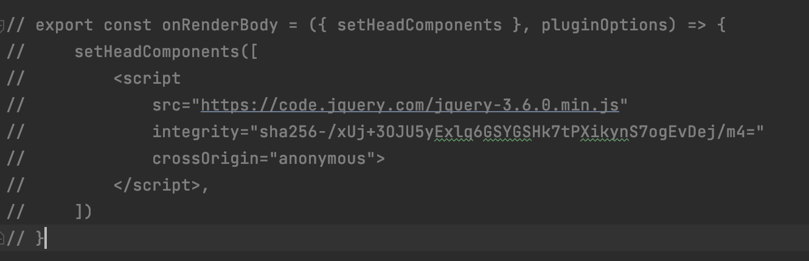
In `gatsby-node.js`
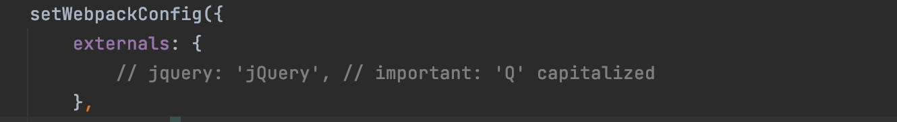
The code above is used to resolve the issue of webpack not being able to find jquery in the build process. You only need to uncomment them in a production build, and it is better to leave them as commented code in development mode, or else
you will get some weird error. This is a known issue with loading bootstrap using webpack.  
Once you have done the things mentioned above, run the following command:  
```bash
$ npm run build
```
This will start the gatsby build process, and the built website will be in a folder called `public`.
To test your build result, run:
```bash
$ npm run serve
```
This will serve the frontend app in your browser.

### Backend

1. Go into backend folder
```bash
$ cd backend
```
2. Create a .env file in the backend folder and add your database url as a environment variable called `DATABASE_URL` (Please contact the dev team if you would like to use the original database url).
   Add your reCaptcha Site key as a variable called `SITE_KEY` in .env
3. Set up the database for prisma and import the mutual aid data (not necessary if using original database).
```bash 
$ npx prisma migrate dev --name init	# If this is your first time, you need to run this to create the tables in your database according to the prisma schema. 
 
$ npx prisma generate	# This will generate the correct data source client code (e.g. Prisma Client), or models that represent tables in the SQLite database, which has been defined in scripts.ts, read more here https://www.prisma.io/docs/concepts/components/prisma-schema#naming

$ npx ts-node ./src/scripts.ts
```

Note: If you have problem running npx prisma introspect , it’s probably because you have an empty database with no table created. In this case, run npx prisma migrate dev --name init instead; this will create the tables in your database according to the prisma schema. 

```bash
$ npx prisma migrate dev --name init
```

4. create a folder called certificate and generate an SSL certificate inside this folder. This is needed so that the server can be served using HTTPS. In development environment, you can use openssl to generate a self-signed certificate, but for production please use a valid certificate authority like [Let's Encrypt](https://letsencrypt.org/) 
to generate an authorized SSL certificate.

5. Start the server
```bash
$ npm install
$ npm start
```
The server should be running on [https://0.0.0.0:443](https://0.0.0.0:443)

**Important Note**: The backend is using port 443 because we have enforced HTTPS access in backend. If the frontend is running on HTTP, the requests to backend will be blocked because they will be considered insecure. During development, you can run the backend through HTTP. To do this,
change the port number to 5000 and comment out the code regarding the credentials and httpsServer in the file `index.ts`. Use `app.listen` instead of `httpsServer.listen`.


## Adding More Languages to the Website
Our website is built to support multiple languages, and we've made it very easy to add new language support.  
To add a new language, see the following steps:  
1. go to the `locales` folder in `frontend/src` and create a new folder named by the country code of the new language(e.g. en for english).
2. in the newly created folder, add a file named `translation.json`. This file should contain all the translations in the new language.
3. After that, find the `config.js` file in the i18n folder and add a new language support in the resources section. follow the format shown in the folling picture:  
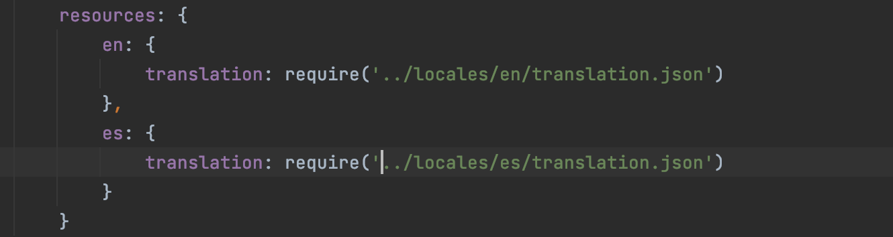
   
## How To Deploy
**Note**: Please push or merge the version you want to deploy to the `deployment` branch, `dev` branch is used for development only.
### Frontend
The frontend of the website is currently deployed on `gh-pages` branch of this repo. We've implemented CI/CD for the frontend, so every push or pull request to the `deployment` branch will trigger the CI/CD workflow in this repo, which will build the website and automatically deploy to github pages.


### Backend
The Dockerfile used for building backend Prisma applications is defined within the backend folder. For databases, the docker image for databases is directly extended based on the original version postgres:13, which is described in the docker-compose.yml file along with other relevant configuration for environment set-up and connections between backend and database. 

For the deployment, compress the entire backend folder into a .zip file, and upload it to the EC2 instance, and then you build and run the docker image within the EC2 instance, by using the following commands:

Building and Running Docker image with docker-compose: (Recommended)
```bash
# Navigate into backend folder
$ cd backend

# Building the docker images for both prisma application and database
docker-compose build

# Running docker images
docker-compose up

# Checking the running images  
docker ps

# Stop the container
docker-compose down
```

(Opt)Commands for Building and Running docker images:
```bash
# Build docker images in current directory
docker build -t getting-started .

# Run docker image in background
docker run -d -p 80:80 getting-started
# -d for detach, run container in background
# -p pushlish-list, publish a container's port(s) to the host

docker stop [container_id …]	# stop running
docker rm  [container_id … ]	# Remove one or more containers
docker rmi [image_id]		# Remove one or more container images
```


## Debug/Troubleshooting

### Problem 1: 

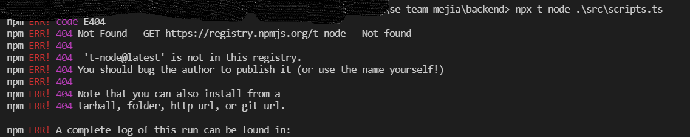

==> It’s saying that it cannot find the module that you are using.

==> In this case it’s a typo, notice it should be  `ts-code`, instead of `t-code`

### Problem 2:

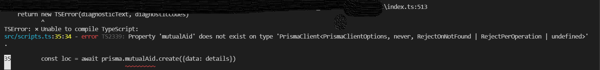

==> In line 35, we are asking it to create a table named mutualAid , but it has problem in finding its definition in the database.

Here is what you want to do to resolve the problem:

==> First, check your database management, see if a table called “MutualAid” has created or not?

If it does, you should see something similar to the picture below:

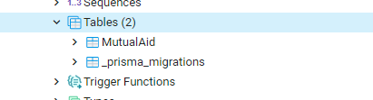

Otherwise, you might want to check scheme.prisma file, and see if you have an Object model that called MutualAid that is defined there. If not, ceated it as shown below:

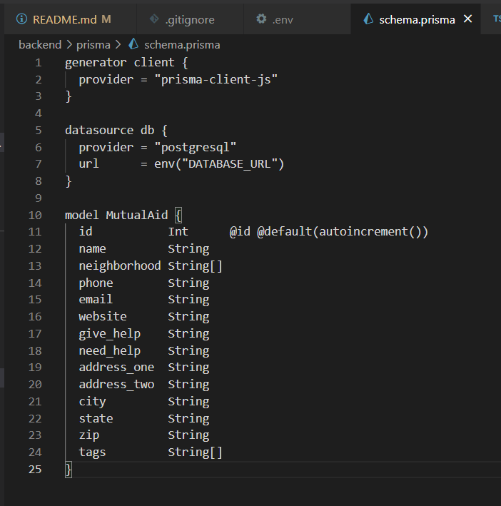

And then run the following command:

```bash
$ npx prisma migrate dev  # ==> This will synchronize the database with your schema defined in schema.prisma file
```

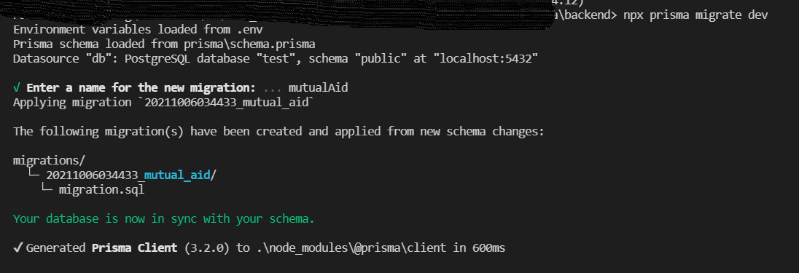

This verifies the creation:

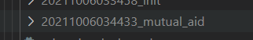

Then type:

```bash
$ npx prisma generate	# This will generate the correct data source client code (e.g. Prisma Client), or models that represent tables in the SQLite database, which has been defined in scripts.ts, read more here https://www.prisma.io/docs/concepts/components/prisma-schema#naming
```


Then you can start generating object records(defined in your index.ts file) into database:

```bash
$ npx ts-node ./src/scripts.ts
# Read more here, https://www.prisma.io/docs/getting-started/setup-prisma/start-from-scratch/mongodb/querying-the-database-typescript-mongodb#write-your-first-query-with-prisma-client
```

After all the data record has been populated, you can start running the backend with `npm start`, and then frontend. And you should see something like this in the end:

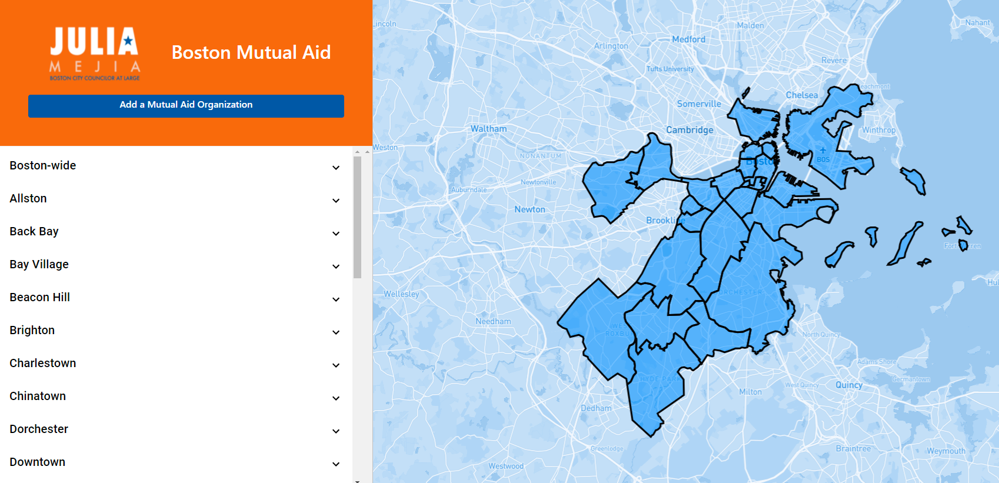


– If you are still confused, read more details here [Prisma Migrate](https://www.prisma.io/docs/concepts/components/prisma-migrate), [Prisma schema](https://www.prisma.io/docs/concepts/components/prisma-schema#naming), [Querying the database](https://www.prisma.io/docs/getting-started/setup-prisma/start-from-scratch/mongodb/querying-the-database-typescript-mongodb#write-your-first-query-with-prisma-client)


## Reference:
- What is your "DATABASE_URL"? ==> [Database connectors PostgreSQL](https://www.prisma.io/docs/concepts/database-connectors/postgresql)
- Getting start with Prisma? ==> https://www.prisma.io/docs/concepts/overview/what-is-prisma

  
